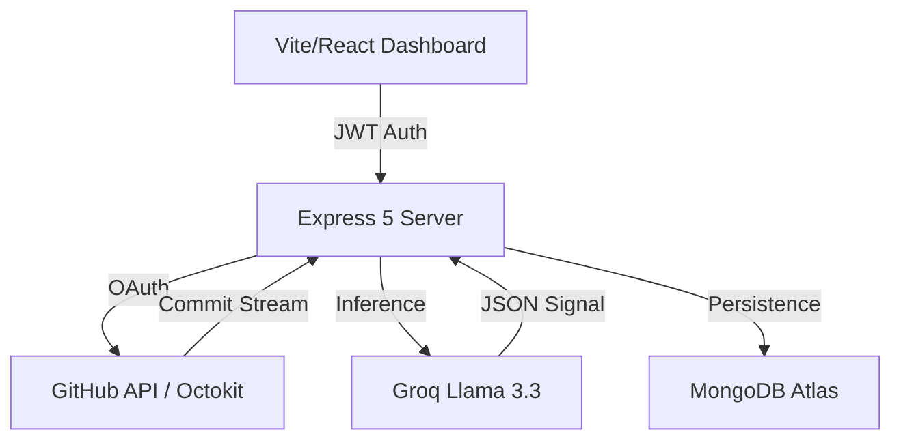

# DEVPULSE // INDUSTRIAL_SIGNAL_ANALYSIS

> **"ALL_SIGNAL. ZERO_FLUFF. SYSTEM_STABILIZED."**

DevPulse is a high-fidelity engineer resonance platform. It converts raw commit narratives into actionable cognitive load telemetry using **Groq-powered Llama 3.3** inference. Designed for high-intensity developers who operate on direct-to-metal principles.

---

## ⚡ CORE_SYSTEM_CAPABILITIES

- **COG_LOAD_MATRIX**: Real-time parsing of commit complexity, code churn (additions/deletions), and files changed.
- **NEURAL_SENTIMENT**: High-speed LLM inference (llama-3.3-70b) to detect frustration, agility, and burnout risk.
- **INDUSTRIAL_DASHBOARD**: A stark, brutalist command center built with Recharts for visual precision and ZERO data persistence.
- **WRAPPED_REPORTING**: Automated extraction of peak activity signals and executive engineering directives.

## 🏗 SYSTEM_ARCHITECTURE



## 🚀 BOOT_PROTOCOLS

### 1. Requirements
- **Node.js**: v20+ (v25 recommended)
- **Database**: MongoDB instance (Atlas clusters supported)
- **API Keys**: GitHub OAuth App Creds + Groq Cloud API Key

### 2. Environment (server/.env)
```env
PORT=5000
NODE_ENV=development
MONGO_URI=mongodb+srv://...
SESSION_SECRET=...
JWT_SECRET=...
GITHUB_CLIENT_ID=...
GITHUB_CLIENT_SECRET=...
GITHUB_CALLBACK_URL=http://localhost:5000/api/v1/auth/github/callback
CLIENT_URL=http://localhost:5173
GROQ_API_KEY=...
```

### 3. Execution
```bash
# 1. Install dependencies
npm run install:all

# 2. Start combined dev environment
npm run dev
# [Port 5000]: API Server
# [Port 5173]: Frontend Client
```

## 🛠 DEPLOYMENT_INDEX

### Rendering (Backend)
- Use **Render** or **Railway**. 
- Environment: Set `NODE_ENV` to `production`.
- Build Command: `npm install`.
- Start Command: `npm start`.

### Vercel (Frontend)
- Build Command: `npm run build`.
- Output Directory: `dist`.
- Framework Preset: `Vite`.

## 📐 DESIGN_PHILOSOPHY
- **STARK_CONTRAST**: #FF6B00 (Orange), #FFD600 (Yellow), #000000 (Black).
- **HEAVY_EDGES**: Uniform 6px+ solid black borders.
- **BRUTALIST_TYPE**: Outfit Black (Italicized for urgency).
- **NO_GRADIENTS**: Solid color blocking for maximum cognitive focus.

---
© 2026 DEVPULSE PLATFORM // AUTHORIZED_SIGNAL_ONLY // [devpulse.io](https://devpulse.io)
